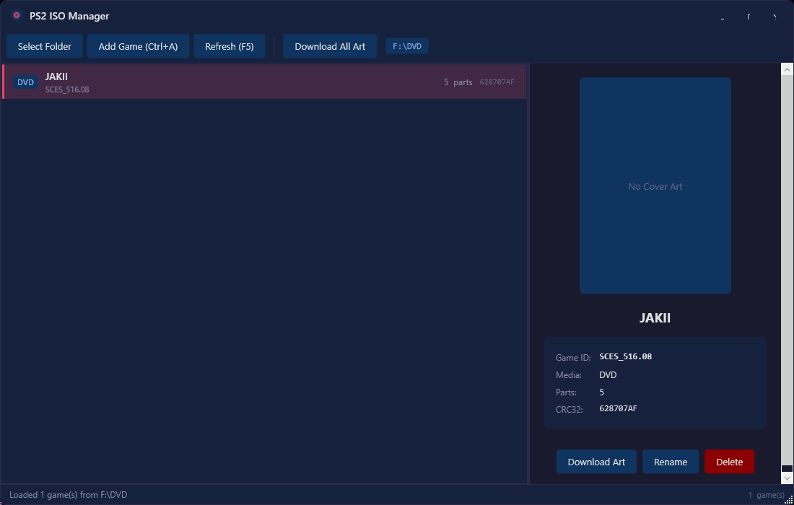

<p align="center">
  
</p>

<p align="center">
  <strong>A modern replacement for USBUtil — split PS2 ISOs for OPL/USBExtreme with style.</strong>
</p>

<p align="center">
  <a href="#features">Features</a> &bull;
  <a href="#screenshot">Screenshot</a> &bull;
  <a href="#installation">Installation</a> &bull;
  <a href="#usage">Usage</a> &bull;
  <a href="#how-it-works">How It Works</a> &bull;
  <a href="#building">Building</a> &bull;
  <a href="#license">License</a>
</p>

---

## What is this?

**PS2 ISO Manager** is a Windows desktop app that does what USBUtil does — but with a clean, modern UI inspired by [Open PS2 Loader (OPL)](https://github.com/ps2homebrew/Open-PS2-Loader). It splits PS2 ISO files into the USBExtreme/OPL format so you can load games from USB on a real PS2.

No more hunting for ancient, sketchy USBUtil downloads. This is open-source, built with .NET 8, and just works.

## Screenshot

<p align="center">
  
</p>

## Features

- **Split PS2 ISOs** into 1 GiB chunks in OPL/USBExtreme format
- **Auto-detect Game ID** by reading SYSTEM.CNF from the ISO (ISO9660 parsing)
- **ul.cfg management** — add, delete, and rename games with proper binary record handling
- **Cover art download** from the [ps2-covers](https://github.com/xlenore/ps2-covers) GitHub archive
- **OPL-style dark theme** — feels right at home if you've used OPL
- **Drag & drop** ISO files directly onto the window
- **Keyboard shortcuts** — `Ctrl+A` add, `F2` rename, `Del` delete, `F5` refresh
- **Remembers your folder** across sessions
- **No external dependencies** — pure .NET 8 WPF, no NuGet packages needed

## Installation

### Option 1: Download Release
Download the latest `.exe` from the [Releases](../../releases) page.

> Requires [.NET 8 Desktop Runtime](https://dotnet.microsoft.com/en-us/download/dotnet/8.0) installed.

### Option 2: Build from Source
```bash
git clone https://github.com/imadali120/PS2IsoManager.git
cd PS2IsoManager
dotnet run --project PS2IsoManager
```

## Usage

1. **Select Folder** — Point to your USB drive or the folder where OPL looks for games (e.g. `F:\DVD`)
2. **Add Game** — Pick a PS2 `.iso` file. The app will:
   - Extract the Game ID from `SYSTEM.CNF` automatically
   - Ask you for a display name (max 32 characters)
   - Split the ISO into 1 GiB chunks with a progress bar
   - Register the game in `ul.cfg`
3. **Download Art** — Fetches cover art and saves it to `ART/{GAME_ID}_COV.jpg` (OPL format)
4. **Rename / Delete** — Right from the detail panel or keyboard shortcuts
5. **Plug USB into PS2** — Boot OPL, your games show up

### Drag & Drop
Just drag `.iso` files onto the window. Multiple files supported.

## How It Works

### USBExtreme / OPL Format

OPL loads games from USB using a specific format:

| Component | Description |
|-----------|-------------|
| `ul.cfg` | Binary file with 64-byte records for each game |
| `ul.{CRC32}.{GAME_ID}.XX` | Split chunk files (1 GiB each) |
| `ART/{GAME_ID}_COV.jpg` | Cover art (optional) |

### ul.cfg Record Layout (64 bytes)

| Offset | Size | Field |
|--------|------|-------|
| `0x00` | 32 | Display name (ASCII, null-padded) |
| `0x20` | 15 | `ul.` + Game ID (null-padded) |
| `0x2F` | 1 | Number of chunk files |
| `0x30` | 1 | Media type (`0x12` = CD, `0x14` = DVD) |
| `0x35` | 1 | `0x08` (USBExtreme magic byte) |

### OPL CRC32

OPL uses a **non-standard CRC32** for naming chunk files. The key differences from standard CRC32:

- Polynomial: `0x04C11DB7`
- **Inverted branching**: XOR when MSB is *not* set (opposite of normal)
- Table indexed with `table[255 - i]` instead of `table[i]`
- Processes `strlen(name) + 1` bytes from a 32-byte null-padded buffer

This must match exactly or OPL won't find your games.

### ISO9660 Game ID Extraction

The app reads the ISO's Primary Volume Descriptor (sector 16), navigates the root directory to find `SYSTEM.CNF`, and parses the `BOOT2` line to extract the game ID:

```
BOOT2 = cdrom0:\SLUS_202.65;1
                 ^^^^^^^^^^^
                 Game ID extracted
```

## Project Structure

```
PS2IsoManager/
├── Models/
│   ├── GameEntry.cs              # Game record model
│   └── MediaType.cs              # CD (0x12) / DVD (0x14) enum
├── Services/
│   ├── OplCrc32.cs               # OPL's non-standard CRC32
│   ├── UlCfgService.cs           # ul.cfg binary read/write
│   ├── IsoSplitterService.cs     # Async ISO chunking with progress
│   ├── Iso9660Reader.cs          # ISO9660 → SYSTEM.CNF → Game ID
│   └── CoverArtService.cs        # Cover art downloader
├── ViewModels/
│   ├── ViewModelBase.cs          # INotifyPropertyChanged
│   ├── RelayCommand.cs           # ICommand implementation
│   ├── MainViewModel.cs          # App logic and commands
│   └── GameEntryViewModel.cs     # Per-game UI wrapper
├── Views/
│   ├── GameListView.xaml         # OPL-style game list
│   ├── GameDetailView.xaml       # Cover art + metadata panel
│   └── ProgressDialog.xaml       # Split progress with cancel
├── Converters/                   # WPF value converters
├── Resources/Themes/
│   └── OplDarkTheme.xaml         # Full dark theme
├── MainWindow.xaml               # Shell with custom chrome
└── App.xaml                      # Entry point + theme loading
```

## Building

**Requirements:** [.NET 8 SDK](https://dotnet.microsoft.com/en-us/download/dotnet/8.0)

```bash
# Build
dotnet build

# Run
dotnet run --project PS2IsoManager

# Publish single-file exe
dotnet publish PS2IsoManager/PS2IsoManager.csproj -c Release -r win-x64 --self-contained -p:PublishSingleFile=true -o publish
```

## Keyboard Shortcuts

| Key | Action |
|-----|--------|
| `Ctrl+A` | Add Game |
| `F2` | Rename selected game |
| `Delete` | Delete selected game |
| `F5` | Refresh game list |

## Acknowledgments

- [Open PS2 Loader](https://github.com/ps2homebrew/Open-PS2-Loader) — the homebrew loader this tool targets
- [ps2-covers](https://github.com/xlenore/ps2-covers) — PS2 cover art archive
- USBUtil / Tihwin — reference implementations for the USBExtreme format

## License

MIT License — do whatever you want with it.
